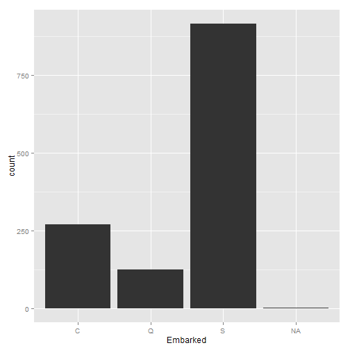
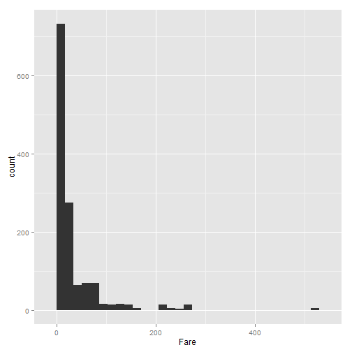
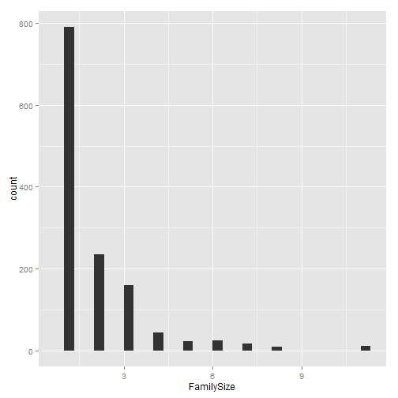
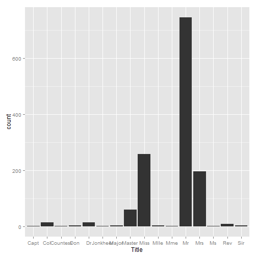
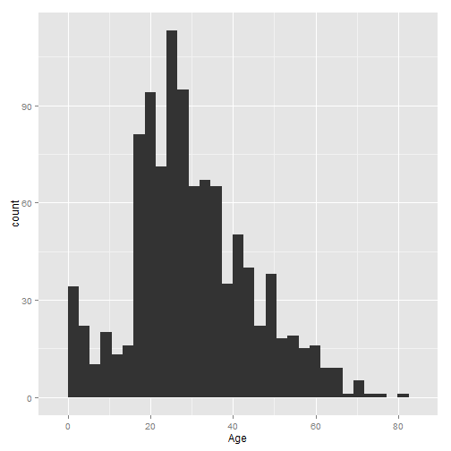
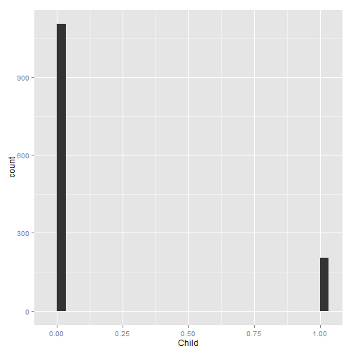
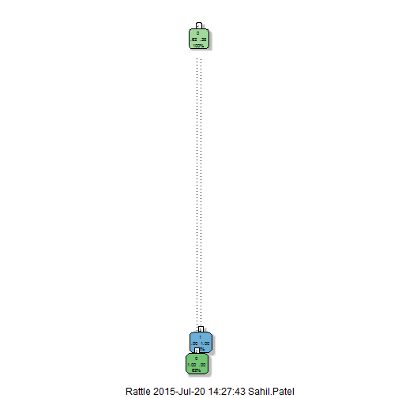
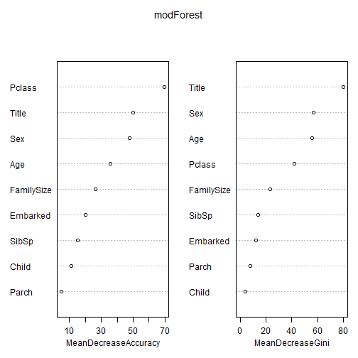

# Kaggle: Titantic Predicting Likelyhood of Survival
Set R options

```r
echo = TRUE
```

Load Relevant Libraries

```r
# Better looking decision tree
library(rattle)
# Plotting library
library(ggplot2)
# Recursive Partitioning and Regression Trees
library(rpart)
# String processing
library(stringr)
# Data processing
library(dplyr)
# Random forest
library(randomForest)
```


## Initial Data Exploration

Load Data

```r
# Training set
train <- read.csv(url("http://s3.amazonaws.com/assets.datacamp.com/course/Kaggle/train.csv"), na.string = c(" ", "", "NA"))
  
# Test set
test <- read.csv(url("http://s3.amazonaws.com/assets.datacamp.com/course/Kaggle/test.csv"),na.string = c(" ", "", "NA"))
```

Check Data

```r
# Check dimensions
# Train
dim(train)
```

```
## [1] 891  12
```

```r
# Test
dim(test)
```

```
## [1] 418  11
```

```r
# Column names
# Train
names(train)
```

```
##  [1] "PassengerId" "Survived"    "Pclass"      "Name"        "Sex"        
##  [6] "Age"         "SibSp"       "Parch"       "Ticket"      "Fare"       
## [11] "Cabin"       "Embarked"
```

```r
# Test
names(test)
```

```
##  [1] "PassengerId" "Pclass"      "Name"        "Sex"         "Age"        
##  [6] "SibSp"       "Parch"       "Ticket"      "Fare"        "Cabin"      
## [11] "Embarked"
```

The noticable difference between the test and training dataset, is that the test data does not have a 'Survived Column'

Checking the column classes of the data ahead of analysis.

```r
# Train data column classes
lapply(train, class)
```

```
## $PassengerId
## [1] "integer"
## 
## $Survived
## [1] "integer"
## 
## $Pclass
## [1] "integer"
## 
## $Name
## [1] "factor"
## 
## $Sex
## [1] "factor"
## 
## $Age
## [1] "numeric"
## 
## $SibSp
## [1] "integer"
## 
## $Parch
## [1] "integer"
## 
## $Ticket
## [1] "factor"
## 
## $Fare
## [1] "numeric"
## 
## $Cabin
## [1] "factor"
## 
## $Embarked
## [1] "factor"
```

```r
# Test data column classes
lapply(test, class)
```

```
## $PassengerId
## [1] "integer"
## 
## $Pclass
## [1] "integer"
## 
## $Name
## [1] "factor"
## 
## $Sex
## [1] "factor"
## 
## $Age
## [1] "numeric"
## 
## $SibSp
## [1] "integer"
## 
## $Parch
## [1] "integer"
## 
## $Ticket
## [1] "factor"
## 
## $Fare
## [1] "numeric"
## 
## $Cabin
## [1] "factor"
## 
## $Embarked
## [1] "factor"
```

Let us check na values for every variable, TRUE indicates there is a na value

```r
# Train
# Na summary for every variable
summary(is.na(train))
```

```
##  PassengerId      Survived         Pclass           Name        
##  Mode :logical   Mode :logical   Mode :logical   Mode :logical  
##  FALSE:891       FALSE:891       FALSE:891       FALSE:891      
##  NA's :0         NA's :0         NA's :0         NA's :0        
##                                                                 
##     Sex             Age            SibSp           Parch        
##  Mode :logical   Mode :logical   Mode :logical   Mode :logical  
##  FALSE:891       FALSE:714       FALSE:891       FALSE:891      
##  NA's :0         TRUE :177       NA's :0         NA's :0        
##                  NA's :0                                        
##    Ticket           Fare           Cabin          Embarked      
##  Mode :logical   Mode :logical   Mode :logical   Mode :logical  
##  FALSE:891       FALSE:891       FALSE:204       FALSE:889      
##  NA's :0         NA's :0         TRUE :687       TRUE :2        
##                                  NA's :0         NA's :0
```

```r
# TOtal na values in the train data
sum(is.na(train))
```

```
## [1] 866
```

```r
# Test
# Na summary for every variable
summary(is.na(test))
```

```
##  PassengerId       Pclass           Name            Sex         
##  Mode :logical   Mode :logical   Mode :logical   Mode :logical  
##  FALSE:418       FALSE:418       FALSE:418       FALSE:418      
##  NA's :0         NA's :0         NA's :0         NA's :0        
##                                                                 
##     Age            SibSp           Parch           Ticket       
##  Mode :logical   Mode :logical   Mode :logical   Mode :logical  
##  FALSE:332       FALSE:418       FALSE:418       FALSE:418      
##  TRUE :86        NA's :0         NA's :0         NA's :0        
##  NA's :0                                                        
##     Fare           Cabin          Embarked      
##  Mode :logical   Mode :logical   Mode :logical  
##  FALSE:417       FALSE:91        FALSE:418      
##  TRUE :1         TRUE :327       NA's :0        
##  NA's :0         NA's :0
```

```r
# Total na values in the test data
sum(is.na(test))
```

```
## [1] 414
```

Let us look at the Survival rate: 1 indicates Survival

```r
survival.summary <- table(train$Survived)
survival.summary
```

```
## 
##   0   1 
## 549 342
```
In the dataset, there were 891 Passengers, of which 342 Survived.

## Merging the datasets

We will need to apply our analysis to both the training and test datasets in a uniform fashion. This is so when we apply our algorithm built on the training set, any new variables will also exist in the test set (provided they are reproducible). 

The test data in the combined dataset will be distinguished where the Survival column is a NA Value


```r
# Bind the test and training set
all.data <- merge(train, test, all = TRUE)
```

Confirm new data has dimensions that include all columns and has the combined row count of the test and training set


```r
dim(all.data)
```

```
## [1] 1309   12
```

```r
nrow(train) + nrow(test) == nrow(all.data)
```

```
## [1] TRUE
```

The all.data now holds the combined training and test dataset. 


```r
summary(is.na(all.data))
```

```
##  PassengerId       Pclass           Name            Sex         
##  Mode :logical   Mode :logical   Mode :logical   Mode :logical  
##  FALSE:1309      FALSE:1309      FALSE:1309      FALSE:1309     
##  NA's :0         NA's :0         NA's :0         NA's :0        
##                                                                 
##     Age            SibSp           Parch           Ticket       
##  Mode :logical   Mode :logical   Mode :logical   Mode :logical  
##  FALSE:1046      FALSE:1309      FALSE:1309      FALSE:1309     
##  TRUE :263       NA's :0         NA's :0         NA's :0        
##  NA's :0                                                        
##     Fare           Cabin          Embarked        Survived      
##  Mode :logical   Mode :logical   Mode :logical   Mode :logical  
##  FALSE:1308      FALSE:295       FALSE:1307      FALSE:891      
##  TRUE :1         TRUE :1014      TRUE :2         TRUE :418      
##  NA's :0         NA's :0         NA's :0         NA's :0
```


## Dealing with NA Values

Bear in mind the Survival NA values are indicative of the test data set. So we will discount them when dealing with NA values.

With this, the total NA values are:

```r
sum(is.na(all.data)) - sum(is.na(all.data$Survived))
```

```
## [1] 1280
```

We could omit these rows of data, but we would be ridding ourselves of valuable data. 

Instead, we will try and fill the existing data where na values are present

### Embarked

Number of na values in the Embarked column are represented below

```r
summary(all.data$Embarked)
```

```
##    C    Q    S NA's 
##  270  123  914    2
```

```r
ggplot(all.data, aes(Embarked)) + geom_histogram()
```

 

Most people embarked from Southampton, we will just assume missing values embarked from there.


```r
all.data$Embarked[is.na(all.data$Embarked)] <- "S"
# Confirm no NA values remain
sum(is.na(all.data$Embarked))
```

```
## [1] 0
```

### Fare

Number of na values in the Fare column are represented below


```r
summary(all.data$Fare)
```

```
##    Min. 1st Qu.  Median    Mean 3rd Qu.    Max.    NA's 
##   0.000   7.896  14.450  33.300  31.280 512.300       1
```

```r
ggplot(all.data, aes(Fare)) + geom_histogram()
```

```
## stat_bin: binwidth defaulted to range/30. Use 'binwidth = x' to adjust this.
```

 

Here, we will assign the median fare value to the overall dataset


```r
all.data$Fare[is.na(all.data$Fare)] <- median(all.data$Fare, na.rm = TRUE)
# COnfirm NA values are non-existant in the Fare column
sum(is.na(all.data$Fare))
```

```
## [1] 0
```

### Age

We will deal with age when we have more features engineered.


### Cabin

The Cabin variable is represented below in the the combined dataset


```r
# Total NA values in the Cabin variable
sum(is.na(all.data$Cabin))
```

```
## [1] 1014
```

```r
# There are too many missing Cabin variables, so we will delete this column

all.data$Cabin <- NULL
```


## Feature Engineering

In my view feature engineering is the most important factor in a machine learning algorithm (with my knowledge to date). Significant features need to be built that summarise the data well.

WIth this, let us look at the data as it stands now:

```r
head(train)
```

```
##   PassengerId Survived Pclass
## 1           1        0      3
## 2           2        1      1
## 3           3        1      3
## 4           4        1      1
## 5           5        0      3
## 6           6        0      3
##                                                  Name    Sex Age SibSp
## 1                             Braund, Mr. Owen Harris   male  22     1
## 2 Cumings, Mrs. John Bradley (Florence Briggs Thayer) female  38     1
## 3                              Heikkinen, Miss. Laina female  26     0
## 4        Futrelle, Mrs. Jacques Heath (Lily May Peel) female  35     1
## 5                            Allen, Mr. William Henry   male  35     0
## 6                                    Moran, Mr. James   male  NA     0
##   Parch           Ticket    Fare Cabin Embarked
## 1     0        A/5 21171  7.2500  <NA>        S
## 2     0         PC 17599 71.2833   C85        C
## 3     0 STON/O2. 3101282  7.9250  <NA>        S
## 4     0           113803 53.1000  C123        S
## 5     0           373450  8.0500  <NA>        S
## 6     0           330877  8.4583  <NA>        Q
```

Briefly, do any additional variables come to mind that can be built on the existing variables that add some insight to the dataset?

I can deduce the following: Title (factor), Child (0 or 1), Family Size (numeric).


### Add Family Size

Add family size by adding together SibSb + Parch + 1

```r
all.data$FamilySize <- all.data$SibSp + all.data$Parch + 1
# Visualise family size
ggplot(all.data, aes(FamilySize)) + geom_histogram()
```

```
## stat_bin: binwidth defaulted to range/30. Use 'binwidth = x' to adjust this.
```

 

### Add Passenger Title

```r
all.data <- mutate(all.data, Title = str_extract(Name, "(Jonkheer|Capt|Countess|Col|Mlle|Major|Don|Sir|Master|Dr|Rev|Mme|Ms|Miss|Mrs|Mr)"))

# COerce characters to factors
all.data$Title <- as.factor(all.data$Title)

# Visualise Title
ggplot(all.data, aes(Title)) + geom_histogram()
```

 

### Age continued

The age variable is represented below in the the combined dataset


```r
# Total NA values in the age variable
sum(is.na(all.data$Age))
```

```
## [1] 263
```

```r
# Plot age variable to get a sense of it
ggplot(all.data, aes(Age)) + geom_histogram()
```

```
## stat_bin: binwidth defaulted to range/30. Use 'binwidth = x' to adjust this.
```

 

```r
# Use decision tree to predict age, we will set method to "anova" since we are trying to predict a continous variable

predicted_age <- rpart(Age ~ Pclass + Sex + SibSp + Parch + Fare + Embarked + Title + FamilySize, data = all.data[!is.na(all.data$Age), ], method = "anova")

# VIew results
predicted_age
```

```
## n= 1046 
## 
## node), split, n, deviance, yval
##       * denotes terminal node
## 
##  1) root 1046 217097.500 29.881140  
##    2) Title=Master,Miss,Mlle,Mme 263  43337.590 18.616620  
##      4) Parch>=0.5 126   9430.361  9.429921  
##        8) Fare< 48.2 101   4455.970  7.106436 *
##        9) Fare>=48.2 25   2226.297 18.816800 *
##      5) Parch< 0.5 137  13493.410 27.065690  
##       10) Pclass>=2.5 68   2897.570 22.301470 *
##       11) Pclass< 2.5 69   7531.304 31.760870 *
##    3) Title=Capt,Col,Countess,Don,Dr,Jonkheer,Major,Mr,Mrs,Ms,Rev,Sir 783 129178.700 33.664750  
##      6) Pclass>=1.5 566  66687.550 30.273850 *
##      7) Pclass< 1.5 217  39008.480 42.509220 *
```

```r
# Predict age where values are NA
all.data$Age[is.na(all.data$Age)] <- predict(predicted_age, all.data[is.na(all.data$Age), ])

# COnfirm NA values have been dealt with
sum(is.na(all.data$Age))
```

```
## [1] 0
```

### Adding Child Variable

If the age of a passenger is below 18, they are a child.


```r
# Assign child as under 18
all.data$Child[all.data$Age < 18] <- 1
# Assign not child over 18
all.data$Child[all.data$Age > 18] <- 0
# People who are 18 are considered adults
all.data$Child[all.data$Age == 18] <- 1
```

Check summary of new child variable

```r
ggplot(all.data, aes(Child)) + geom_histogram()
```

```
## stat_bin: binwidth defaulted to range/30. Use 'binwidth = x' to adjust this.
```

 

```r
table(all.data$Child)
```

```
## 
##    0    1 
## 1104  205
```


## View final combined data set

Lets view the final data


```r
lapply(all.data, class)
```

```
## $PassengerId
## [1] "integer"
## 
## $Pclass
## [1] "integer"
## 
## $Name
## [1] "factor"
## 
## $Sex
## [1] "factor"
## 
## $Age
## [1] "numeric"
## 
## $SibSp
## [1] "integer"
## 
## $Parch
## [1] "integer"
## 
## $Ticket
## [1] "factor"
## 
## $Fare
## [1] "numeric"
## 
## $Embarked
## [1] "factor"
## 
## $Survived
## [1] "integer"
## 
## $FamilySize
## [1] "numeric"
## 
## $Title
## [1] "factor"
## 
## $Child
## [1] "numeric"
```

## General Algorithm Guidelines

"Psychologist Gord Gigerenzer cautions that in uncertain markets, it is better to simplify, use heuristics and rely on fewer variables. In stable and predictable markets, on the other hand, he recomends organizations 'complexity' and use algorithms with more variables"

## Split data back into training and test

```r
# Assign train set
train <- all.data[!is.na(all.data$Survived),]

#Assign test set
test <- all.data[is.na(all.data$Survived),]
test$Survived <- NULL

# Ensure all data has been assigned
nrow(all.data) == nrow(train) + nrow(test)
```

```
## [1] TRUE
```
## First ML Algorithm: Decission Tree


```r
# Train Decision Tree
modTreeOne <- rpart(Survived ~ Title + FamilySize + Child + Embarked + Parch + SibSp + Fare + Age + Sex + Name + Pclass, data = train, method = "class")

# Visualise tree
fancyRpartPlot(modTree)
```

 

```r
# Predict
treePredOne <- predict(modTreeOne, test, type = "class")

# Create Solution
TreeSolOne <- data.frame(PassengerId = test$PassengerId, Survived = treePredOne)

# Create csv file
write.csv(TreeSolOne, "TreeSolOne.csv", row.names = FALSE)
```
This submission scored 75.598% on Kaggle

## Second ML Algorithm: Let's overfit

To demonstrate the consequences of overfitting, we will adjust the parameters in our decision tree algorithm.


```r
# Train second tree
modTreeTwo <- rpart(Survived ~ Title + FamilySize + Child + Embarked + Parch + SibSp + Fare + Age + Sex + Name + Pclass, data = train, method = "class", control=rpart.control(minsplit=50, cp=0))

# Viualise second tre
fancyRpartPlot(modTreeTwo)
```

 

```r
# Predict the second tree
treePredTwo <- predict(modTreeTwo, test, type = "class") 

# Create Solution
TreeSolTwo <- data.frame(PassengerId = test$PassengerId, Survived = treePredTwo)

# Create submission file
write.csv(TreeSolTwo, "TreeSolTwo.csv", row.names = FALSE)
```

This solution scored 75.598%

## Third ML Algorithm: Random Forest

Following we will deploy a random forest algorithm to predict survival


```r
# Set seed for reproducibility
set.seed(111)

# Train random forest
modForest <- randomForest(as.factor(Survived) ~ Pclass + Child + FamilySize + Sex + Age + SibSp + Parch + Embarked + Title, data = train, importance = TRUE, ntree = 1000)

# Predict random forest
predForest <- predict(modForest, test)

# Create a solution
ForSolOne <- data.frame(PassengerId = test$PassengerId, Survived = predForest )

# Create solution for kaggle
write.csv(ForSolOne, "ForSolOne.csv", row.names = FALSE)

# Make Visualisation of Improtant Variables

varImpPlot(modForest)
```

 

This scored 77.990% on Kaggle
